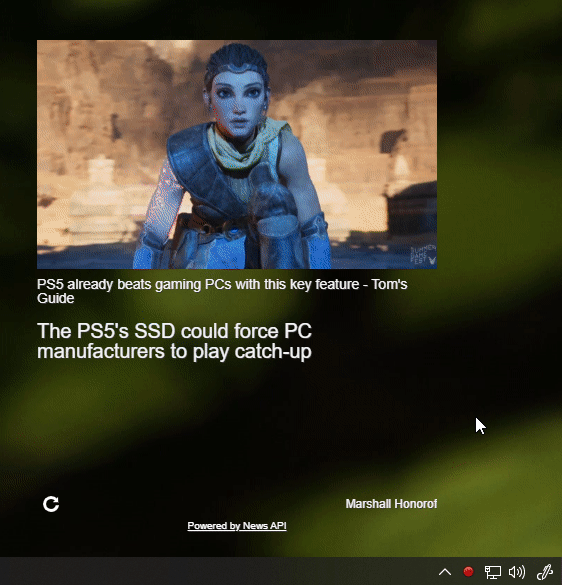

### Frameless news reader

#### What is it?
This is a basic slider for desktop that pulls from a news feed. The whole "gimmick" about it is this frameless aesthetic I had envisioned. Will see if it actually looks/works as I imagined.

#### Current state
Functional however not as designed, had problems with automatic sliding/didn't finish implementing web worker for self-refresh every day.

#### Requirements(API KEY)
Note: this initially used News API however that is not free after you develop/expensive for personal use. I currently switched over to Microsoft Bing News with Rapid API, I don't know if it's as good/bad. The content does not seem as diverse as News API and the photos are terrible.

#### Build process
The main thing to get is that the `reactjs` app is built using `npm run build` and then the Electron part is automatic, the `main.js` file pulls in the `index.html` file from the `reactjs` build. So all you have to do is, run the `reactjs` build first, then run the Electron packager second. Then you'll have your build folder in your specified OS with the `.exe` file. There are other steps to do an actual release where you can install the app by a single file. It's called `Electron Builder`. I have not done that myself so I don't know how that works at this time.

#### Limitations
**Transparent windows are not resizeable.** [Electron docs](https://www.electronjs.org/docs/api/frameless-window#limitations)
I thought I should point this out, this is fine for me. I'll briefly investigate if you can set specific size breakpoints and then toggle them, but not a big priority for me after I settle on a basic design. As an aside/FYI. I use a huge 34" curved monitor for my desk so this app is sized for that.

Also I personally do not intend to use this much, just a "starting my day" thing. I'm aiming to build it with a self-refresh but it's not going to do a lot of requests only top headlines. You can configure it yourself what you want it to do, but keep the 500 query/day limit in mind.

#### Build log
[Medium](https://medium.com/@jdc_cunningham/build-log-making-a-frame-less-news-desktop-app-8c474ad002c)

#### Attributes
As mentioned this is using [NewsAPI](https://newsapi.org). I also pulled icons from [uxwing](https://uxwing.com/)
